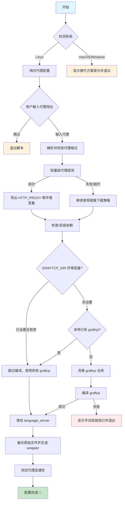

# 反重力代理配置工具

为 反重力 Agent 配置代理，解决网络连接问题。

## 系统支持

| 系统        | 支持情况      | 说明                           |
| ----------- | ------------- | ------------------------------ |
| **Linux**   | ✅ 完全支持   | 使用 graftcp 自动代理          |
| **macOS**   | ⚠️ 需替代方案 | 推荐使用 Proxifier 或 TUN 模式 |
| **Windows** | ⚠️ 需替代方案 | 推荐使用 Proxifier 或 TUN 模式 |

## Linux 使用方法

### 1. 下载脚本

```bash
curl -O https://raw.githubusercontent.com/ccpopy/antissh/main/antissh.sh
# 或者国内加速下载
# curl -O https://ghproxy.net/https://raw.githubusercontent.com/ccpopy/antissh/main/antissh.sh
chmod +x antissh.sh
```

### 2. 运行脚本

```bash
bash ./antissh.sh
```

### 3. 脚本执行流程



### 4. 按提示操作

脚本会依次：

- 询问是否需要配置代理
- 输入代理地址，格式如下：
  - SOCKS5: `socks5://127.0.0.1:10808`
  - HTTP: `http://127.0.0.1:10809`
- 自动安装依赖和编译 graftcp
- 自动查找并配置 language_server

### 5. 修改代理

直接重新运行脚本即可更新代理设置。

### 6. 恢复原始状态

```bash
mv /path/to/language_server_xxx.bak /path/to/language_server_xxx
```

路径会在脚本执行完成后显示。

### 注意

IDE 升级后可能会在 `~/.antigravity-server/bin/` 下新增版本目录，导致之前配置的代理失效。

**解决方法（二选一）：**

1. **推荐**：直接重新运行脚本，脚本会自动检测新目录并重新配置
2. **手动迁移**：
   - 进入新目录 `~/.antigravity-server/bin/<新版本号>/extensions/antigravity/bin/`
   - 将 `language_server_linux_*` 重命名为 `language_server_linux_*.bak`
   - 将原目录中的 wrapper 脚本（即之前配置的 `language_server_linux_*`）复制到新目录

### WSL 网络配置（Mirrored 模式）

如果你在 WSL 中使用本脚本，建议开启 **Mirrored 网络模式**，这样 WSL 可以直接使用宿主机的代理（127.0.0.1）。

**配置方法：**

1. 在 Windows 用户目录下创建或编辑 `.wslconfig` 文件：

```ini
# %USERPROFILE%\.wslconfig
[wsl2]
networkingMode=mirrored
```

2. 重启 WSL：

```powershell
wsl --shutdown
```

3. 重新进入 WSL 后，代理地址可直接使用 `127.0.0.1`：

```bash
# 例如
socks5://127.0.0.1:10808
http://127.0.0.1:10809
```

> **注意**：Mirrored 模式需要 Windows 11 22H2 及以上版本，且 WSL 版本 >= 2.0.0。
>
> 如果不使用 Mirrored 模式，需要使用 WSL 虚拟网卡的网关 IP（通常是 `cat /etc/resolv.conf` 中的 nameserver 地址）。

---

## macOS / Windows 替代方案

由于 graftcp 依赖 Linux 的 `ptrace` 系统调用，在 macOS/Windows 上无法使用。

### 推荐方案 1：Proxifier（推荐）

1. 下载安装 [Proxifier](https://www.proxifier.com/)
   - 关于 license key，请自行搜索，有特别版序列号，如有能力请支持正版
2. 添加代理服务器：
   - `Profile` → `Proxy Servers` → `Add`
   - 填入你的代理地址
3. 添加规则：`Profile` → `Proxification Rules` → `Add`
   - 应用程序添加以下内容（根据系统选择）：
     - macOS: `com.google.antigravity.helper; com.google.antigravity; Antigravity; language_server_macos_arm; language_server_macos_x64`
     - Windows: `language_server_windows_x64.exe; Antigravity.exe`
   - Action 选择刚添加的代理

### 推荐方案 2：TUN 模式

使用 Clash、Surge 等工具开启 TUN 模式，实现全局透明代理。

### 方案 3：环境变量（不推荐）

Agent 服务可能无法走代理，仅供参考：

```bash
export ALL_PROXY=socks5://127.0.0.1:10808
export HTTPS_PROXY=http://127.0.0.1:10809
```

---

## 依赖要求

- **Go**: >= 1.13（脚本会自动安装）
- **Git, Make, GCC**（脚本会自动安装）

## 鸣谢

- [graftcp](https://github.com/hmgle/graftcp)
- [思路来源](https://www.v2ex.com/t/1174113)

### Contributors

[](https://github.com/ccpopy/antissh/graphs/contributors)

## Star History

[](https://www.star-history.com/#ccpopy/antissh&type=date&legend=top-left)
